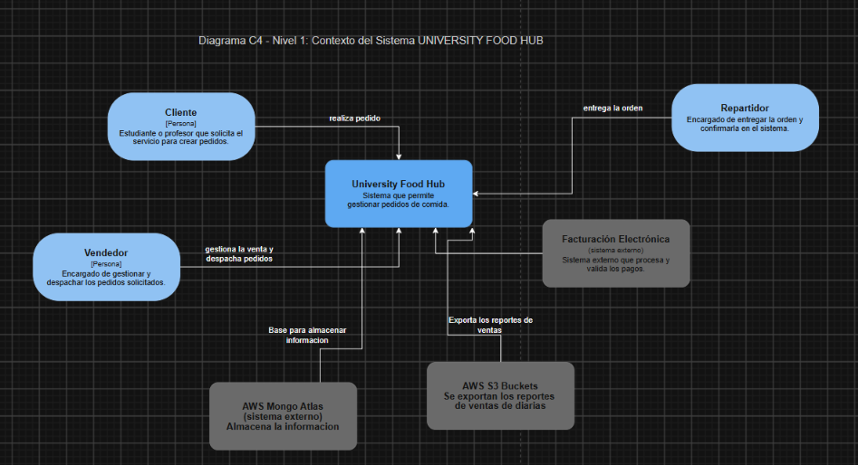

# DOSW_Parcial_T1_JoseMartinez

Jose Alejandro Martinez Arias - DOSW Grupo - 1

link bitacora: https://github.com/JoseMartinez883/DOSW_BITACORA

Evidencias de acceso de Draw y Figma

## Punto 1 - Diagrama de contexto C4

## Requerimientos

### Requerimientos funcionales
- Calcular el precio final en tiempo real y mostrar un resumen del pedido
- Un pedido puede contener hasta 5 productos distintois, cada uno con sus propios extras y una preferencia de entrega (buider)
- Un producto base puede tener varios personalizables o extras (decorator)

### Requerimientos no funcionales
- Tipografía: La tipografia de la aplicacion debe ser Poppings ](Google Fonts)
- Colores de la cafetería: Azul (#1B3A5C) y Dorado (#C67A00)

## Historias de Usuario

### Historia de Usuario 1

---

Título: Crear un pedido múltiple y personalizado.

Como Cliente
Quiero poder armar mi pedido paso a paso, agregando hasta 5 productos distintos y seleccionando mi preferencia de entrega.
Para poder tener control sobre lo que voy a consumir y cómo lo voy a recibir, teniendo en cuenta mis gustos.

Criterios de Aceptación:
- El sistema debe permitir al usuario ir agregando productos a una "orden en construcción" (Máximo 5).
- Antes de finalizar, el usuario debe poder elegir si es "Para llevar" o "Comer en el sitio".

### Historia de Usuario 2

---

Título: Modificar un producto con ingredientes extra.

Como: Cliente
Quiero: Poder añadir ingredientes extra o hacer modificaciones a un producto base (ej. añadir extra queso o quitar salsas).
Para: Adaptar la comida exactamente a mis gustos personales.

Criterios de Aceptación:
- Al seleccionar un producto, el sistema debe mostrar los extras compatibles disponibles.
- El precio y el resumen del producto deben actualizarse en tiempo real al agregar o quitar un extra.

# Evidencia Figma y Analisis Requerimientos

Link de Figma: https://www.figma.com/make/OwXVrVbK4jZsqfI6c6aAzT/Cafeter%C3%ADa-responsive-app-design?t=eimuvQ4YP6KTHBMx-1

## Punto 6

Identifique los 2 patrones asignados (Iterator y Composite), especificando para cada uno:
a.  Nombre del patrón y tipo (creacional, estructural o de comportamiento)
Creacional – Builder
Decorator - Estructural

b.  Justificación de la decisión en el contexto de ECI Paw Connect
En este caso, se nos dice que los productos pueden tener varios personalizables, teniendo en cuenta un producto base, por lo tanto se podria pensar con el patron decorator, que nos permitiria añadir los distintos tipos de extras de cada producto, sin afectar el producto base.
Por el lado de Builder, para la construccion de dicho producto base o pedido base.

c.  Diagrama de clases UML de la solución con los dos patrones aplicados

d.  Cuáles principios SOLID está aplicando y porque

-   S – Single responsibility, ya que cada clase se encarga de una responsabilidad en especificia, por lo tanto no sobrecargamos las clases con varias responsabilidades o razones de existir

-   O – Open/Closed al aplicar o depender de clases abstractas y interfaces, si queremos agregar nuevas funcionalidades en un future, no seria un problema o tocaria mover el codigo inicial

-   L – Likvos’s susbsition, ya que Las clases derivadas (subclase) sustitituyen las superclases base (superclase), en este caso, seria que implementen la clases abstracta de manera valida

-   I – Interface Segregation, al aplicar las interfaces y que todos los que la implementan, la implementen de manera valida

-   D – Al depender de abstracciones e interfaces estamos hacienda que modulos de bajo snivel y alto nivel dependen de las mismas

