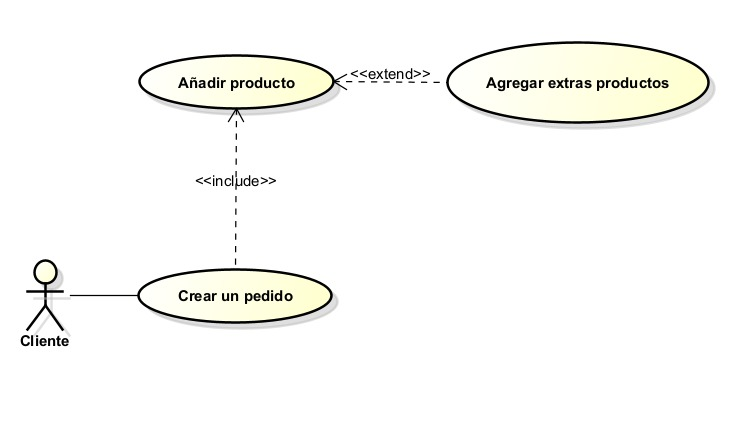
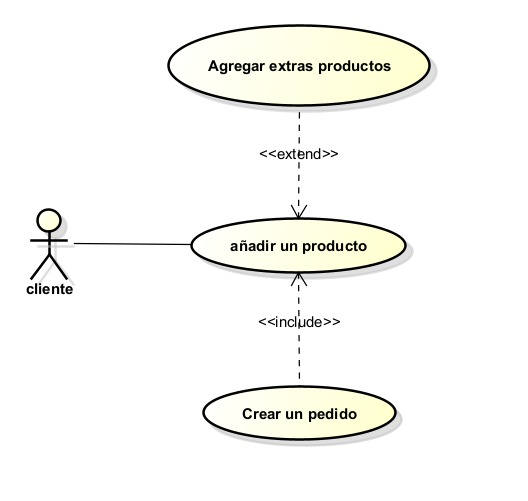

# DOSW_Parcial_T1_JoseMartinez

Jose Alejandro Martinez Arias - DOSW Grupo - 1

link bitacora: https://github.com/JoseMartinez883/DOSW_BITACORA

Evidencias de acceso de Draw y Figma

## Historias de Usuario

### Historia de Usuario 1

---

Título: Crear un pedido múltiple y personalizado.

Como Cliente
Quiero poder armar mi pedido paso a paso, agregando hasta 5 productos distintos y seleccionando mi preferencia de entrega.
Para poder tener control sobre lo que voy a consumir y cómo lo voy a recibir, teniendo en cuenta mis gustos.

Criterios de Aceptación:
- El sistema debe permitir al usuario ir agregando productos a una "orden en construcción" (Máximo 5).
- Antes de finalizar, el usuario debe poder elegir si es "Para llevar" o "Comer en el sitio".

### Historia de Usuario 2

---

Título: Modificar un producto con ingredientes extra.

Como: Cliente 
Quiero: Poder añadir ingredientes extra o hacer modificaciones a un producto base (ej. añadir extra queso o quitar salsas).
Para: Adaptar la comida exactamente a mis gustos personales.

Criterios de Aceptación:
- Al seleccionar un producto, el sistema debe mostrar los extras compatibles disponibles.
- El precio y el resumen del producto deben actualizarse en tiempo real al agregar o quitar un extra.

