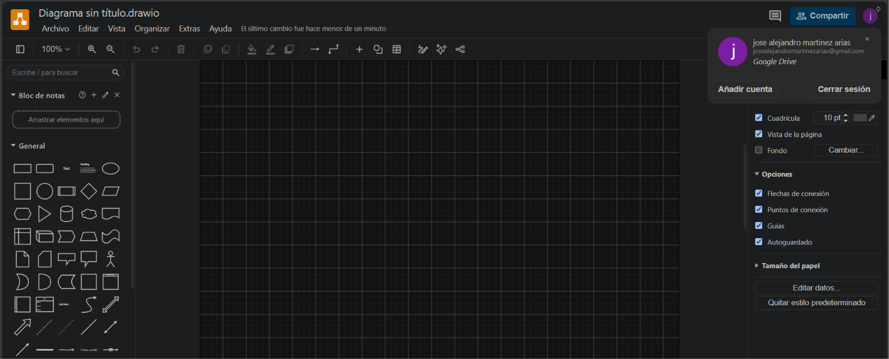
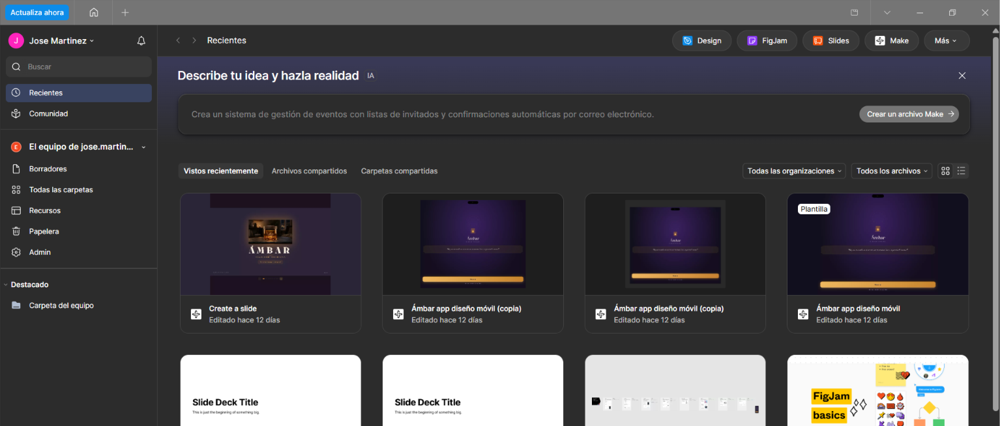
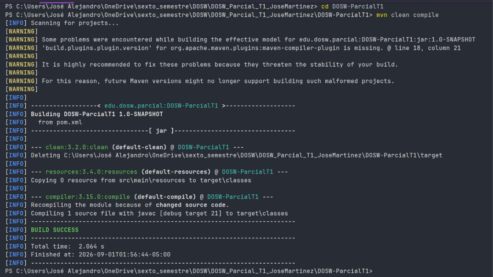
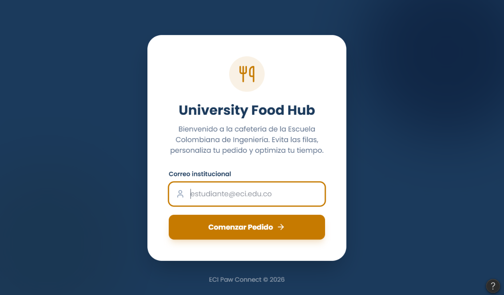
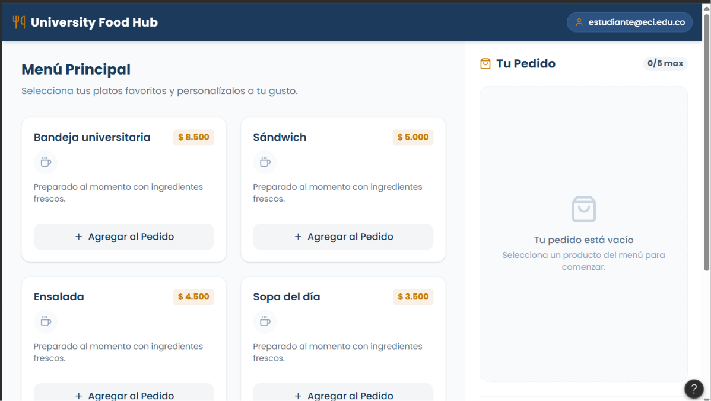
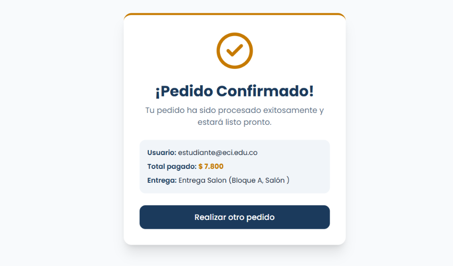

# DOSW_Parcial_T1_JoseMartinez

Jose Alejandro Martinez Arias - DOSW Grupo - 1

link bitacora: https://github.com/JoseMartinez883/DOSW_BITACORA

Evidencias de acceso de Draw y Figma

Link de Figma: https://www.figma.com/make/OwXVrVbK4jZsqfI6c6aAzT/Cafeter%C3%ADa-responsive-app-design?t=eimuvQ4YP6KTHBMx-1

# Evidencia Figma y Analisis Requerimientos

